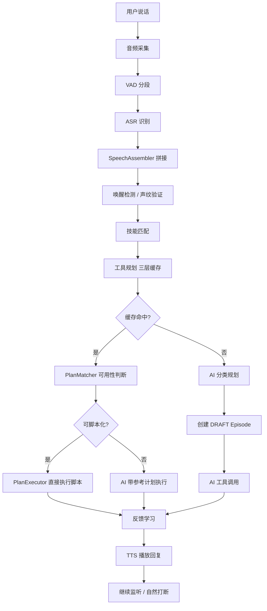

# 03 - 核心执行流程

## 1. 总流程概览

从用户说话到 AI 回复播放，完整链路分为 **7 个阶段**：



**核心线程模型：**

| 线程 | 类 | 职责 |
|------|------|------|
| `bg-recorder` | `DesktopBrainApplication` → `startBackgroundRecording()` | 持续录音、VAD 分段、ASR 识别、声纹验证、拼接 |
| `speech-handler` | `DesktopBrainApplication` → `handleSpeechEvents()` | 消费语音队列、状态机流转、调度 AI 执行 |
| `ai-worker` (按需) | `DesktopBrainApplication` → `processAITurn()` | 工具规划 + AI 执行 + 反馈学习 |
| `tts-playback` | `TtsService` → `playbackLoop()` | 异步 TTS 播放 |
| 主线程 | `DesktopBrainApplication` → `CommandLineRunner` | 文字输入模式 |

---

## 2. 详细步骤

### 2.1 音频采集阶段

**入口：** `DesktopBrainApplication.startBackgroundRecording()`（后台录音线程）

#### 步骤 1：PCM 数据采集

```
TargetDataLine (16kHz, 16bit, mono) → byte[] buffer (3200 bytes)
```

- 以 16kHz 采样率持续读取麦克风 PCM 数据
- 每次读取 `min(line.available(), 3200)` 字节（约 100ms 音频）
- 转换为 float 数组（`pcmToFloat()`）供后续处理

#### 步骤 2：VAD 语音活动检测

**类：** `VadService`（Silero VAD v4 神经网络）

```
float[] samples → vadService.acceptWaveform()
                → vadService.hasSegment() 轮询
                → vadService.nextSegment() 取出分段
```

**VAD 参数：**
- `threshold = 0.5`（偏敏感，配合后续能量校验）
- `minSilenceDuration = 1.2s`
- `minSpeechDuration = 0.25s`（过滤过短噪音）
- `maxSpeechDuration = 8s`
- `windowSize = 512`

**回退机制：** VAD 模型不可用时（`vadService.isAvailable() == false`），降级为能量检测 `calcEnergyFallback()`，阈值 `ENERGY_THRESHOLD = 0.02f`，静音超过 2 秒分段。

#### 步骤 3：尾部音频拼接（trailBuf）

为避免 VAD 截断导致句首丢失，维护一个 `trailBuf`（200ms 环形缓冲区）：

```
trailBuf = new float[SAMPLE_RATE / 5]  // 3200 samples = 200ms
```

每次语音段结束时，将 `trailBuf` 内容拼接到段开头：`withTrail = speech + trailBuf`

#### 步骤 4：ASR 语音识别

**类：** `LocalASR`（双引擎）

| 模式 | 引擎 | 模型 | 精度 | 延迟 |
|------|------|------|------|------|
| IDLE 状态 | `OnlineRecognizer` | zipformer int8 | 低（唤醒词用） | 快 |
| VOICE_DIALOG 状态 | `OfflineRecognizer` | Paraformer zh-small | 高（对话用） | 稍慢 |

```java
// IDLE 模式：低延迟在线识别
text = localASR.recognizeOnline(withTrail, SAMPLE_RATE);

// VOICE_DIALOG 模式：高精度离线识别
text = localASR.recognizeOffline(withTrail, SAMPLE_RATE);
```

**过滤规则：** 空文本或以 `(` 开头的结果（如 `(未识别到语音)`）直接丢弃。

#### 步骤 5：语音拼接（解决多段问题）

**类：** `SpeechAssembler`

**问题：** 用户说"打开微信"可能被 VAD 切成"打开"和"微信"两段。

**机制：** debounce 窗口（默认 500ms）

```java
speechAssembler.addSegment(text)  // 逐段拼接
// 返回 true → 继续等待后续片段
// 返回 false → 当前片段属于新句子，先 flush 之前积累的
speechAssembler.getFullSentence()  // 获取完整句子
speechQueue.offer(complete)  // 送入语音事件队列
```

后台线程每轮循环还会检查 `speechAssembler.hasPending()`，若已超过 debounce 窗口则主动 flush。

**输出：** `LinkedBlockingQueue<String> speechQueue` — 完整文本句子

---

### 2.2 唤醒与身份验证

**入口：** `DesktopBrainApplication.handleSpeechEvents()`（语音事件处理线程）

#### 步骤 1：DialogStateMachine 状态判断

**类：** `DialogStateMachine`

```
状态转换规则：
  IDLE ──唤醒词──→ LISTENING
  LISTENING ──用户说完──→ PROCESSING
  PROCESSING ──AI 生成回复──→ SPEAKING
  SPEAKING ──TTS 播放完毕──→ LISTENING
  SPEAKING ──用户说话──→ INTERRUPTED
  INTERRUPTED ──处理打断内容──→ LISTENING
```

**IDLE 状态行为：**
- 只做模糊监听（打印 `💤 模糊监听中...`）
- 检测唤醒词 `"那个谁"`（`WAKE_WORD` 常量）
- 命中后：`transitionTo(LISTENING)` → `mode = VOICE_DIALOG` → `ttsService.speakAsync("我在")`

**LISTENING 状态行为：**
- 5 秒无语音 → 回到 IDLE（`silenceCount` 累计 10 次 × 500ms 轮询间隔）

#### 步骤 2：声纹验证

**类：** `VoiceprintService`

**执行时机：** 在 ASR 之前，用原始音频 `withTrail` 直接做声纹比对。

```java
// 录音线程中执行：
if (voiceprintService.isAvailable() && voiceprintService.listSpeakers().length > 0) {
    speaker = voiceprintService.search(withTrail, SAMPLE_RATE);
    currentSpeaker = speaker;  // 写入 volatile 变量
}
```

**声纹引擎：** sherpa-onnx `SpeakerEmbeddingExtractor`
- 模型：`models/speaker-embedding/model.onnx`（3D-Speaker）
- 阈值：`similarityThreshold = 0.6`
- 注册机制：3 段语音 → `registerSpeakerMultiSegment()`

**降级处理：**
- 声纹模型未加载 → 任何人声音均可唤醒
- 已启用但无注册用户 → 提示"可选注册"，不阻塞使用
- SPEAKING/PROCESSING 状态被打断时，声纹不匹配（`currentSpeaker == null`）则忽略打断

---

### 2.3 技能匹配

**入口：** `DesktopBrainApplication.processAITurn()` → `skillConfig.getInstructions(userInput)`

**类：** `SkillConfig`

**技能文件格式：** `src/main/resources/skills/*.txt`

```
第一行: keywords: 打开,启动,launch
其余行: 技能规则指令文本
```

**匹配逻辑：**
1. 热加载检测（每 2 秒）：检查 skills 目录文件变更
2. 正则匹配：将 keywords 编译为 `Pattern`，对用户输入做 `find()` 匹配
3. 多技能累加：所有匹配技能的指令文本拼接

```java
String skillInstructions = skillConfig.getInstructions(userInput);
if (!skillInstructions.isEmpty()) {
    effectiveInput = skillInstructions + "\n用户请求：" + userInput;
}
```

**示例：** 用户说"打开微信" → 匹配 `app-launch.txt`（关键词含"打开"），注入"打开应用"的操作规范。

---

### 2.4 工具规划（核心三层）

**入口：** `DesktopBrainApplication.processAITurn()` → `toolPlanner.plan(userInput, tools)`

**类：** `ToolPlanner`

#### Layer 1：内存缓存（精确匹配，最快）

```java
CacheEntry entry = cache.get(normalizeKey(userInput));
```

- Key = `normalizeKey()`：去除数字、空白、标点后的小写字符串
- 命中条件：完全相同的归一化输入
- 存储内容：`selectedToolNames` + `missingDescriptions` + `episodeId` + `episode` 引用 + `failureCount`

#### Layer 2：Episode 向量检索（语义匹配，跨重启持久化）

**类：** `EpisodeCacheService` → `findSimilarEpisode(userInput)`

```java
// 1. Embed 用户输入
List<Float> queryVector = embeddingService.embed(userInput);

// 2. Qdrant 搜索
Map<String, Object> filter = {
    "must": [
        {"key": "archived", "equals": false},
        {"key": "stability", "range": {"gte": 0.6}},
        {"key": "status", "match": {"value": "ACTIVE"}}
    ]
};
// score_threshold = 0.65
// top_k = 3
// 按 computedStability() 排序取最佳
```

命中后**回填内存缓存**（`cache.put()`），下次相同输入直接命中 Layer 1。

#### Layer 3：AI 分类规划

**类：** `ToolPlanner.doPlan()` + `ToolCategoryService`

当 Layer 1、Layer 2 均未命中时调用：

1. embed(userInput) → Qdrant `tool-categories` 向量搜索，返回匹配的**动态分类列表**（随工具增减自动调整）
2. AI 根据匹配到的分类选择所需工具编号
3. 无匹配 → 降级到 5 个硬编码兜底分类
4. 过滤掉不存在的工具，缺失项用 `MISSING:` 标记

**规划结果：** `ToolPlanner.PlanResult`
```java
record PlanResult(
    List<String> selectedToolNames,    // 选中的工具
    List<String> missingDescriptions,  // 缺失的工具描述
    boolean fromCache,                 // 是否来自缓存
    String episodeId,                  // 关联 Episode ID
    Episode episode                    // 完整 Episode（含 lesson 和 toolCalls）
)
```

#### 工具缺失 → 自动生成（异步）

当 `missingDescriptions` 非空时，**异步触发**工具自生成（不阻塞当前请求，当前请求用兜底工具继续执行）：

```java
if (!plan.missingDescriptions().isEmpty()) {
    for (String desc : plan.missingDescriptions()) {
        triggerToolGeneration(desc, ttsService);  // 异步
    }
}
```

生成流程（详见 [08-工具自生成与动态加载.md](file:///e:/projcket/my/myhelper/docs/08-工具自生成与动态加载.md)）：
1. `ToolGenerator.generate()` — AI 生成 .java 源码
2. `ToolCompiler.compileAndPersist()` — 临时目录编译验证 → 持久化到 `generated/` 目录
3. 编译失败带错误信息重试（最多 2 次）
4. 成功 → TTS 播报"已生成新工具，重启后生效"

---

### 2.5 AI 执行阶段

#### 路径 A：缓存命中 + 脚本化执行（最快）

**条件：** `plan.fromCache() && episode.isScriptable()`

`isScriptable()` = `canScript && status==ACTIVE && toolCalls 非空`

`canScript` 条件：`successCount >= 5 && stability > 0.9`

**执行流程：**

1. **PlanMatcher 可用性判断**
   ```java
   MatchResult matchResult = planMatcher.match(userInput, episode);
   // AI 判断：计划步骤是否适用于当前输入 → 提取变量值
   ```
   
2. **变量替换**
   `PlanExecutor.resolveVariables()` 将 toolCalls 中的 `$contact`、`$message` 等占位符替换为实际值。

3. **逐步执行**
   `PlanExecutor.executeScript()` 遍历 `episode.toolCalls`，依次调用 `ToolCallback.call(resolvedArgs)`。

4. **成功 → 通知上层**
   `toolPlanner.onCacheHitSuccess()` → 重置内存失败计数 → 异步 `incrementSuccess()`。

#### 路径 B：缓存命中 + AI 带参考计划执行

**条件：** `plan.fromCache() && !episode.isScriptable()`

```java
// 附加 lesson 到 prompt
augmentedInput = effectiveInput
    + "\n\n--- 历史成功经验 ---\n" + episode.successLesson()
    + "\n\n--- 历史失败教训 ---\n" + episode.failureLesson();

// AI 带参考计划执行
executeWithTools(chatClient, augmentedInput, tools, plan, toolCallLogs);
```

#### 路径 C：新规划执行

**条件：** `!plan.fromCache()`

```java
// 1. 创建 DRAFT Episode
String draftId = toolPlanner.createDraftEpisode(userInput, plan);

// 2. AI 执行（Spring AI ChatClient）
String response = executeWithTools(chatClient, effectiveInput, tools, plan, toolCallLogs);

// 3. Reflect 成功
String successLesson = reflectService.reflectSuccess(userInput, toolCallLogs, response);

// 4. DRAFT → ACTIVE
toolPlanner.activateDraftEpisode(draftId, toolCallLogs, response, successLesson);

// 5. 写入内存缓存
toolPlanner.cacheToMemory(userInput, plan, draftId, toolCallLogs, response, successLesson);
```

#### AI 执行核心：`executeWithTools()`

```java
private String executeWithTools(ChatClient chatClient, String input,
                                ToolCallback[] allTools, PlanResult plan,
                                List<ToolCallLog> toolCallLogs) {
    // 1. 从全部工具中过滤出选中的
    ToolCallback[] selectedTools = filter by plan.selectedToolNames;

    // 2. 包装为带日志的工具
    ToolCallback[] loggedTools = map → new LoggingToolCallback(tc, toolCallLogs);

    // 3. Spring AI ChatClient 调用
    return chatClient.prompt()
        .user(input)
        .toolCallbacks(loggedTools)
        .call()
        .content();
}
```

**LoggingToolCallback 职责：**
- 打印每次工具调用的参数和结果
- 收集 `ToolCallLog` 到 `toolCallLogs` 列表
- 成功/失败均记录（args 和 result 截断到 500 字符）

**AI 系统提示：**
```
你是一个 Windows 桌面助手，能够通过工具控制鼠标、键盘、窗口和屏幕。
你需要将用户的自然语言指令转换为具体的工具调用。
如果用户的要求不明确，请向用户提问澄清。
```

**工具注册：**
- MCP 工具（GUI 操控、截图、OCR、键盘鼠标等）
- 本地工具：`FriendMatcher.findFriend()`、`CapabilityService.listLocalSkills()`、`HaToolService`
- 合并为统一 `ToolCallback[]` 数组

---

### 2.6 反馈学习

#### 成功路径

```
AI 执行成功
  → ReflectService.reflectSuccess()
    AI 总结成功经验（30 字内）
    例: "先打开微信再搜索联系人，最后输入消息发送"
  → EpisodeCacheService.activateDraft()
    更新 toolCalls + aiResponse + successLesson
    successCount+1，stability 重算
    successCount≥5 && stability>0.9 → canScript=true
    status=ACTIVE
  → 写入内存缓存
```

#### 失败路径

```
AI 执行失败
  → ReflectService.reflectFailure()
    AI 归因判断（JSON 返回）：
    {"isPlanIssue": true/false, "lesson": "失败教训"}
  → 分支处理：
    isPlanIssue=true  → 计划问题
      Episode: failureCount+1，stability 下降
      达阈值(≥3次 或 stability<0.3) → archived=true
      内存: failureCount+1，达阈值(3次) → 清除缓存
    isPlanIssue=false → 环境问题
      不惩罚计划，只存 failureLesson
      尝试分段继续（buildContinuePrompt）
```

#### 稳定度计算公式

```
stability = successCount / (successCount + failureCount)
```

- `stability ≥ 0.6`：可被 Episode 检索命中
- `stability > 0.9 && successCount ≥ 5`：可脚本化跳过 AI
- `stability < 0.3`：自动归档

---

### 2.7 TTS 播放

**类：** `TtsService`（sherpa-onnx OfflineTts + VITS 模型）

#### 播放流程

```java
// AI 处理完成后：
ttsService.speakAsync(response);

// 内部流程：
// 1. tts.generate(text) → float[] 采样数据
// 2. 转换为 PCM byte[] (16bit, signed, little-endian)
// 3. playQueue.offer(audio) → 异步队列
// 4. playbackLoop() 消费队列 → SourceDataLine 播放
```

#### 自然打断机制

```
TTS 播放中（ttsService.isPlaying() == true）
  → 录音线程持续监听
  → 检测到用户语音 → 触发打断
  → ttsService.stop()  → 清空播放队列
  → interruptCurrentAi() → 设置 currentAiTurnId = -1
  → handleSpeechEvents() 接收新输入 → 作为新指令处理
```

#### 播放完成

```
TTS 播放完成
  → DialogStateMachine: SPEAKING → LISTENING
  → 继续监听用户输入
```

---

## 3. 异常流程

### 3.1 自然打断

**场景：** AI 正在思考或 TTS 正在播报时，用户插话。

```
handleSpeechEvents() 检测到 state==SPEAKING || state==PROCESSING
  → 声纹检查（已注册时只响应本人声音，currentSpeaker==null 则忽略）
  → dialogStateMachine.transitionTo(INTERRUPTED)
  → interruptCurrentAi()  // currentAiTurnId = -1
  → ttsService.stop()      // 停止 TTS 播放
  → playBeep(400, 80)      // 播放低提示音
  → 打断内容作为新指令走正常处理流程
```

**AI 中断标志：** 每个 AI turn 有唯一 `aiTurnId`（`AtomicLong`），`currentAiTurnId == -1` 表示已被中断。执行过程中每步检查 `currentAiTurnId == myTurnId`，若不等则放弃后续操作。

### 3.2 补充信息

**场景：** AI 执行中用户补充了相关信息。

```
handleSupplement():
  Step 1: 声纹验证（currentSpeaker 匹配）
  Step 2: 语义关联判断（isSemanticallyRelated()）
    - 新输入长度 ≤ 50 字
    - 包含补充关键词（"补充"/"对了"/"还有"/"顺便"等）
    - 关键词重叠度 ≥ 30%（bigram 切分 + AI 回复关键词）
  Step 3: 询问用户确认
    → "检测到补充信息，是否加入？"
    → awaitingSupplementConfirm = true

  用户确认（"对"/"是"/"确认"）:
    combinedInput = lastUserInput + "\n\n--- 补充信息 ---\n" + supplement
    interruptCurrentAi()
    用 combinedInput 重新执行 AI turn

  用户拒绝（"不对"/"不是"）:
    → 继续原 AI 执行

  用户说了其他内容:
    → 作为新请求处理
```

### 3.3 执行失败

**场景：** 工具调用抛异常或 AI 返回错误。

```
executeWithTools() 抛异常
  → ReflectService.reflectFailure()
    AI 归因：计划问题 vs 环境问题
  → 环境问题（isPlanIssue=false）:
    buildContinuePrompt(originalInput, errorMsg, lesson)
    → "请继续完成上述任务，忽略已完成的步骤"
    → try 分段继续
  → 计划问题（isPlanIssue=true）:
    → handleCacheFailure()
      toolPlanner.replan(userInput, tools, errorReason)
      用失败原因重新 AI 规划
      创建新 DRAFT → 执行 → Reflect → 缓存
```

**PlanExecutor 脚本失败处理：**

```
executeScript() 某步抛异常
  → 返回 ExecutionResult.failed(executed, failedIndex, error)
  → ReflectService.reflectFailure() 归因
  → 环境问题 → executeFromStep(episode, failedIndex+1, ...)
    从失败步之后继续执行
  → 计划问题 → 重新规划
```

### 3.4 声纹不匹配

**场景：** 已注册用户开启声纹保护，非注册用户尝试使用。

```
VoiceprintService.search() 返回 null（相似度 < 阈值 0.6）
  → currentSpeaker = null
  → IDLE 状态: 允许唤醒（因为需要先唤醒才能对话）
  → SPEAKING/PROCESSING 状态打断:
    if (voiceprintAvailable && hasVoiceprints && currentSpeaker == null):
        "🔇 声纹不匹配，忽略打断"
        continue  // 不处理打断内容
  → 对话内容不标签:
    System.out.println("🎤 听到 [未识别]: " + text)
    正常处理（但记录为未识别说话人）
```

**注意：** 声纹验证在 ASR 之前执行，使用原始音频。即使 ASR 识别准确，声纹比对失败仍会影响打断响应。

---

## 4. 关键数据结构流转

### 4.1 音频采集 → 文本

| 阶段 | 输入 | 处理 | 输出 | 关键变量 |
|------|------|------|------|----------|
| PCM 采集 | 麦克风 | `TargetDataLine.read()` | `byte[]` buffer (3200B) | `available`, `count` |
| PCM→Float | `byte[]` | `pcmToFloat()` | `float[]` samples | `n = len/2`, s/32768.0f |
| VAD | `float[]` | `vadService.acceptWaveform()` + `hasSegment()`/`nextSegment()` | `SpeechSegment` (含 float[] speech) | `trailBuf` (200ms 环形缓冲) |
| 能量校验 | `float[]` speech | `calcEnergyFallback()` | 过滤低能量 | `ENERGY_THRESHOLD = 0.02f` |
| 声纹验证 | `float[]` withTrail | `voiceprintService.search()` | `String speaker` / null | `similarityThreshold = 0.6` |
| ASR | `float[]` withTrail | `LocalASR.recognizeOnline/Offline()` | `String text` | 状态相关：online vs offline |
| 拼接 | `String text` | `speechAssembler.addSegment()` / `getFullSentence()` | `String complete` | `debounceWindowMs = 500` |
| 入队 | `String complete` | `speechQueue.offer()` | 队列元素 | `LinkedBlockingQueue<String>` |

### 4.2 文本 → AI 回复

| 阶段 | 输入 | 处理 | 输出 | 关键变量 |
|------|------|------|------|----------|
| 出队 | `speechQueue` | `speechQueue.poll(500ms)` | `String text` | — |
| 状态判断 | `DialogStateMachine.getState()` | IDLE/LISTENING/PROCESSING/SPEAKING | 路由分支 | `currentState`, `mode` |
| 唤醒检测 | `text.contains("那个谁")` | `transitionTo(LISTENING)` | 进入对话模式 | `WAKE_WORD = "那个谁"` |
| 打断检测 | state==SPEAKING/PROCESSING | `interruptCurrentAi()` + `ttsService.stop()` | 中断当前 turn | `currentAiTurnId` |
| 补充判断 | 非空 text | `handleSupplement()` → `isSemanticallyRelated()` | 确认/拒绝/新请求 | `awaitingSupplementConfirm` |
| 技能匹配 | `String userInput` | `skillConfig.getInstructions()` | `String skillInstructions` | 正则匹配 `.txt` 文件关键词 |
| 工具规划 | `userInput` + `allTools` | `toolPlanner.plan()` 三层缓存 | `PlanResult` | `CacheEntry` (内存), `Episode` (Qdrant) |
| DRAFT 创建 | userInput + plan | `createDraftEpisode()` → Qdrant | `episodeId` | UUID |
| 脚本匹配 | userInput + episode | `planMatcher.match()` | `MatchResult` (variables) | AI JSON 解析 |
| 脚本执行 | episode + variables + tools | `planExecutor.executeScript()` | `ExecutionResult` | `ToolCallLog` 列表 |
| AI 执行 | effectiveInput + selectedTools | `chatClient.prompt().user().toolCallbacks().call()` | `String response` | `LoggingToolCallback` 包装 |
| 日志收集 | 每次工具调用 | `LoggingToolCallback.call()` → `collector.add()` | `List<ToolCallLog>` | `toolCallLogs` (synchronized) |
| 成功反思 | userInput + toolCallLogs + response | `reflectService.reflectSuccess()` | `String successLesson` | AI 总结 30 字内 |
| 失败归因 | userInput + toolCallLogs + error | `reflectService.reflectFailure()` | `FailureAnalysis(lesson, isPlanIssue)` | 归因 JSON 解析 |
| DRAFT→ACTIVE | episodeId + toolCalls + response | `activateDraft()` → Qdrant 更新 | 更新后的 Episode | `successCount+1`, `stability` |
| DRAFT→FAILED | episodeId + toolCalls + lesson | `failDraft()` → Qdrant 更新 | FAILED Episode | `failedStepIndex` |
| 内存缓存 | userInput + plan + episodeId | `cacheToMemory()` → `ConcurrentHashMap` | `CacheEntry` | `failureCount` 跟踪 |

### 4.3 AI 回复 → 播放

| 阶段 | 输入 | 处理 | 输出 | 关键变量 |
|------|------|------|------|----------|
| TTS 合成 | `String response` | `ttsService.speakAsync()` → `OfflineTts.generate()` | `GeneratedAudio` | `ttsSampleRate` |
| PCM 编码 | `float[]` samples | ×32767 → `byte[]` (16bit PCM) | `byte[] pcm` | `signed little-endian` |
| 异步队列 | `GeneratedAudio` | `playQueue.offer()` / `poll()` | 队列元素 | `LinkedBlockingQueue` (容量 5) |
| 播放 | `byte[] pcm` | `SourceDataLine.write()` | 扬声器输出 | `playing`, `stopFlag` |
| 自然打断 | 检测到用户语音 | `stopFlag.set(true)` + `line.stop()` | 停止播放 | `ttsService.isPlaying()` |
| 状态恢复 | 播放完成 | `transitionTo(LISTENING)` | 继续监听 | — |

### 4.4 核心数据结构

**Episode**（Qdrant 持久化单元）

| 字段 | 类型 | 说明 |
|------|------|------|
| `id` | String (UUID) | Qdrant point ID |
| `userInput` | String | 用户原话（用于重新 embed） |
| `selectedToolNames` | List\<String\> | 选中工具 |
| `toolCalls` | List\<ToolCallLog\> | 完整执行脚本 |
| `aiResponse` | String | AI 回复（≤500 字符） |
| `successLesson` | String | 成功经验（≤30 字） |
| `failureLesson` | String | 失败教训（≤30 字） |
| `signature` | Map\<String,String\> | 变量签名（如 `contact→user_input`） |
| `successCount` | int | 累计成功次数 |
| `failureCount` | int | 累计失败次数 |
| `stability` | double | `success/(success+failure)` |
| `canScript` | boolean | 可脚本化标志 |
| `status` | EpisodeStatus | DRAFT / ACTIVE / FAILED |

**ToolCallLog**（执行轨迹最小单元）

| 字段 | 类型 | 说明 |
|------|------|------|
| `toolName` | String | 工具名 |
| `args` | String | 调用参数（≤500 字符） |
| `result` | String | 调用结果（≤500 字符） |
| `success` | boolean | 是否成功 |
| `elapsedMs` | long | 耗时 |

**DialogStateMachine.State**

| 状态 | 含义 | 可接受输入 | 可被打断 |
|------|------|-----------|----------|
| IDLE | 待命 | 仅唤醒词 | 否 |
| LISTENING | 精确监听 | 是 | 否 |
| PROCESSING | AI 处理中 | 是 | 是 |
| SPEAKING | TTS 播放中 | 是 | 是 |
| INTERRUPTED | 被打断 | 是 | 否 |
