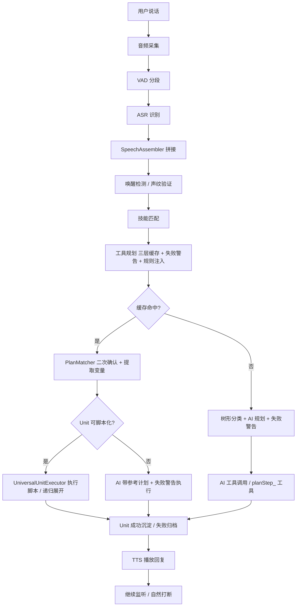

# 03 - 核心执行流程

## 1. 总流程概览

从用户说话到 AI 回复播放，完整链路分为 **7 个阶段**：



**核心线程模型：**

| 线程 | 类 | 职责 |
|------|------|------|
| `bg-recorder` | `MyHelperApplication` → `startBackgroundRecording()` | 持续录音、VAD 分段、ASR 识别、声纹验证、拼接 |
| `speech-handler` | `MyHelperApplication` → `handleSpeechEvents()` | 消费语音队列、状态机流转、调度 AI 执行 |
| `ai-worker` (按需) | `TurnProcessor` → `process()` | 工具规划 + AI 执行 + 反思学习 + 失败经验处理 |
| `tts-playback` | `TtsService` → `playbackLoop()` | 异步 TTS 播放 |
| 主线程 | `MyHelperApplication` → `CommandLineRunner` | 文字输入模式 |
| `rule-induction` (定时) | `RuleInductionService` → `@Scheduled` | 每天凌晨 3 点跨案例归纳规则 |
| `exploration-scheduler` (定时) | `AutonomousExplorationService` → `@Scheduled` | 每 5 分钟巡检空闲条件触发探索 |
| `memory-maintenance` (定时) | `MemoryMaintenanceService` → `@Scheduled` | 每天凌晨 4 点清理低价值数据 |

---

## 2. 详细步骤

### 2.1 音频采集阶段

**入口：** `MyHelperApplication.startBackgroundRecording()`（后台录音线程）

#### 步骤 1：PCM 数据采集

```
TargetDataLine (16kHz, 16bit, mono) → byte[] buffer (3200 bytes)
```

- 以 16kHz 采样率持续读取麦克风 PCM 数据
- 每次读取 `min(line.available(), 3200)` 字节（约 100ms 音频）
- 转换为 float 数组（`pcmToFloat()`）供后续处理

#### 步骤 2：VAD 语音活动检测

**类：** `VadService`（Silero VAD v4 神经网络）

```
float[] samples → vadService.acceptWaveform()
                → vadService.hasSegment() 轮询
                → vadService.nextSegment() 取出分段
```

**VAD 参数：**
- `threshold = 0.5`（偏敏感，配合后续能量校验）
- `minSilenceDuration = 1.2s`
- `minSpeechDuration = 0.25s`（过滤过短噪音）
- `maxSpeechDuration = 8s`
- `windowSize = 512`

**回退机制：** VAD 模型不可用时（`vadService.isAvailable() == false`），降级为能量检测 `calcEnergyFallback()`，阈值 `ENERGY_THRESHOLD = 0.02f`，静音超过 2 秒分段。

#### 步骤 3：尾部音频拼接（trailBuf）

为避免 VAD 截断导致句首丢失，维护一个 `trailBuf`（200ms 环形缓冲区）：

```
trailBuf = new float[SAMPLE_RATE / 5]  // 3200 samples = 200ms
```

每次语音段结束时，将 `trailBuf` 内容拼接到段开头：`withTrail = speech + trailBuf`

#### 步骤 4：ASR 语音识别

**类：** `LocalASR`（双引擎）

| 模式 | 引擎 | 模型 | 精度 | 延迟 |
|------|------|------|------|------|
| IDLE 状态 | `OnlineRecognizer` | zipformer int8 | 低（唤醒词用） | 快 |
| VOICE_DIALOG 状态 | `OfflineRecognizer` | Paraformer zh-small | 高（对话用） | 稍慢 |

```java
// IDLE 模式：低延迟在线识别
text = localASR.recognizeOnline(withTrail, SAMPLE_RATE);

// VOICE_DIALOG 模式：高精度离线识别
text = localASR.recognizeOffline(withTrail, SAMPLE_RATE);
```

**过滤规则：** 空文本或以 `(` 开头的结果（如 `(未识别到语音)`）直接丢弃。

#### 步骤 5：语音拼接（解决多段问题）

**类：** `SpeechAssembler`

**问题：** 用户说"打开微信"可能被 VAD 切成"打开"和"微信"两段。

**机制：** debounce 窗口（默认 500ms）

```java
speechAssembler.addSegment(text)  // 逐段拼接
// 返回 true → 继续等待后续片段
// 返回 false → 当前片段属于新句子，先 flush 之前积累的
speechAssembler.getFullSentence()  // 获取完整句子
speechQueue.offer(complete)  // 送入语音事件队列
```

后台线程每轮循环还会检查 `speechAssembler.hasPending()`，若已超过 debounce 窗口则主动 flush。

**输出：** `LinkedBlockingQueue<String> speechQueue` — 完整文本句子

---

### 2.2 唤醒与身份验证

**入口：** `MyHelperApplication.handleSpeechEvents()`（语音事件处理线程）

#### 步骤 1：DialogStateMachine 状态判断

**类：** `DialogStateMachine`

```
状态转换规则：
  IDLE ──唤醒词──→ LISTENING
  LISTENING ──用户说完──→ PROCESSING
  PROCESSING ──AI 生成回复──→ SPEAKING
  SPEAKING ──TTS 播放完毕──→ LISTENING
  SPEAKING ──用户说话──→ INTERRUPTED
  INTERRUPTED ──处理打断内容──→ LISTENING
```

**IDLE 状态行为：**
- 只做模糊监听（打印 `💤 模糊监听中...`）
- 检测唤醒词 `"那个谁"`（`WAKE_WORD` 常量）
- 命中后：`transitionTo(LISTENING)` → `mode = VOICE_DIALOG` → `ttsService.speakAsync("我在")`

**LISTENING 状态行为：**
- 5 秒无语音 → 回到 IDLE（`silenceCount` 累计 10 次 × 500ms 轮询间隔）

#### 步骤 2：声纹验证

**类：** `VoiceprintService`

**执行时机：** 在 ASR 之前，用原始音频 `withTrail` 直接做声纹比对。

```java
// 录音线程中执行：
if (voiceprintService.isAvailable() && voiceprintService.listSpeakers().length > 0) {
    speaker = voiceprintService.search(withTrail, SAMPLE_RATE);
    currentSpeaker = speaker;  // 写入 volatile 变量
}
```

**声纹引擎：** sherpa-onnx `SpeakerEmbeddingExtractor`
- 模型：`models/speaker-embedding/model.onnx`（3D-Speaker）
- 阈值：`similarityThreshold = 0.6`
- 注册机制：3 段语音 → `registerSpeakerMultiSegment()`

**降级处理：**
- 声纹模型未加载 → 任何人声音均可唤醒
- 已启用但无注册用户 → 提示"可选注册"，不阻塞使用
- SPEAKING/PROCESSING 状态被打断时，声纹不匹配（`currentSpeaker == null`）则忽略打断

---

### 2.3 技能匹配

**入口：** `MyHelperApplication.processAITurn()` → `skillConfig.getInstructions(userInput)`

**类：** `SkillConfig`

**技能文件格式：** `src/main/resources/skills/*.txt`

```
第一行: keywords: 打开,启动,launch
其余行: 技能规则指令文本
```

**匹配逻辑：**
1. 热加载检测（每 2 秒）：检查 skills 目录文件变更
2. 正则匹配：将 keywords 编译为 `Pattern`，对用户输入做 `find()` 匹配
3. 多技能累加：所有匹配技能的指令文本拼接

```java
String skillInstructions = skillConfig.getInstructions(userInput);
if (!skillInstructions.isEmpty()) {
    effectiveInput = skillInstructions + "\n用户请求：" + userInput;
}
```

**示例：** 用户说"打开微信" → 匹配 `app-launch.txt`（关键词含"打开"），注入"打开应用"的操作规范。

---

### 2.4 工具规划（核心三层）

**入口：** `MyHelperApplication.processAITurn()` → `toolPlanner.plan(userInput, tools)`

**类：** `ToolPlanner`

#### Layer 1：内存缓存（精确匹配，最快）

```java
CacheEntry entry = cache.get(normalizeKey(userInput));
```

- Key = `normalizeKey()`：去除数字、空白、标点后的小写字符串
- 命中条件：完全相同的归一化输入
- 存储内容：`selectedToolNames` + `missingDescriptions` + `episodeId` + `episode` 引用 + `failureCount`

#### Layer 2：Unit 语义检索（跨重启持久化）

**类：** `UnitStore` → `findSimilar(userInput, limit)`（旧路径 `EpisodeCacheService.findSimilarEpisode` 兼容保留）

```java
// 1. Embed 用户输入（matchText 语义向量）
List<Float> queryVector = embeddingService.embed(userInput);

// 2. Qdrant 搜索 unit-registry 集合
//    filter: status = ACTIVE
//    score_threshold = 0.6
//    top_k 取相似 Unit，回 Neo4j 补全 Unit 结构
```

命中后**回填内存缓存**（`cache.put()`），下次相同输入直接命中 Layer 1。

#### Layer 3：多轮树形分类 + AI 规划

**类：** `ToolPlanner.doPlan()` + `ToolCategoryService`

当 Layer 1、Layer 2 均未命中时调用，按 `06-工具与技能体系.md` §4.3 树形分类多轮渐进式交互：

1. **Round 1**：`buildL1Prompt()` 展示 L1 大类列表（name + description + toolCount），AI 返回 `{"categories": [...], "reason": "..."}`（限选 1-3 个，超出硬截断）
2. **Round 2**（可选）：若选中 L1 有 L2 子类 → `buildL2Prompt()` 展示子类列表，AI 返回 `{"categories": [...], "reason": "..."}`（限选 1-2 个）；无 L2 则直接收集工具；轮次 ≥ `maxCategoryRounds`(默认3) 则降级为全量工具前 50 个
3. **Round 3**：展示收集到的工具列表（name + description）→ AI 返回 `{"tools": [...], "plan": "...", "missing": [...]}` → `parseFinalResponse()` 解析验证

**防死循环与异常**：路径记忆（visitedIds，重选拒绝）、禁止回退、maxCategoryRounds 限制、工具列表 > 50 自动截断（放行 listAllTools）、分类名不存在→模糊匹配候选→AI 重试、AI 不选分类→searchTool/listAllTools 兜底路径传前 50 个工具、非 JSON 响应优雅降级

**规划结果：** `ToolPlanner.PlanResult`
```java
record PlanResult(
    List<String> selectedToolNames,    // 选中的工具
    List<String> missingDescriptions,  // 缺失的工具描述
    boolean fromCache,                 // 是否来自缓存
    String episodeId,                  // 关联 Episode ID
    Episode episode,                   // 完整 Episode（含 lesson 和 toolCalls）
    List<FailureSearchResult> failureWarnings,  // 历史失败警告
    boolean allowListAllTools          // 分类降级信号：是否放行 listAllTools 兜底
)
```

#### 工具缺失 → 自动生成（异步）

当 `missingDescriptions` 非空时，**异步触发**工具自生成（不阻塞当前请求，当前请求用兜底工具继续执行）：

```java
if (!plan.missingDescriptions().isEmpty()) {
    for (String desc : plan.missingDescriptions()) {
        triggerToolGeneration(desc, ttsService);  // 异步
    }
}
```

生成流程（详见 [08-工具自生成与动态加载.md](file:///e:/projcket/my/myhelper/docs/08-工具自生成与动态加载.md)）：
1. `ToolGenerator.generate()` — AI 生成 .java 源码
2. `ToolCompiler.compileAndPersist()` — 临时目录编译验证 → 持久化到 `generated/` 目录
3. 编译失败带错误信息重试（最多 2 次）
4. 成功 → TTS 播报"已生成新工具，重启后生效"

---

### 2.5 AI 执行阶段

#### 路径 A：缓存命中 + Unit 脚本化执行（最快）

**条件：** `plan.fromCache() && unit.scriptable()`

脚本化条件（对齐文档 15 §7.2）：无递归子步骤 + 无数据流依赖 + 步骤数 ≤ 5（或 `successCount ≥ 5 && stability > 0.9`）+ 无 FALLBACK/DISABLES。

**执行流程：**

1. **PlanMatcher 二次确认**
   ```java
   MatchResult matchResult = planMatcher.match(userInput, unit);
   // AI 判断：Unit 是否适用于当前输入 → 提取变量值
   ```

2. **万能执行器（统一入口）**
   `UniversalUnitExecutor.executePlanStep(unitId, paramsJson)` 三分支：
   - 原子工具直调（`toolName` 非空）
   - 脚本化（遍历 `script`，`$varName` 替换）
   - 递归展开（加载 `CONTAINS` 子节点按 order 执行，支持 `$stepName.varName`）

3. **成功 → 通知上层**
   `toolPlanner.onCacheHitSuccess()` → 重置内存失败计数 → 异步 `unitStore.incrementSuccess()`。

#### 路径 B：缓存命中 + AI 带参考计划执行

**条件：** `plan.fromCache() && !unit.scriptable()`

```java
// 附加 Unit 经验到 prompt
augmentedInput = effectiveInput
    + "\n\n--- 历史成功经验 ---\n" + String.join("\n", unit.notes());

// AI 带参考计划执行（工具中含 planStep_ 包装工具）
executeWithTools(chatClient, augmentedInput, tools, plan, toolCallLogs);
```

#### 路径 C：新规划执行

**条件：** `!plan.fromCache()`

```java
// 1. AI 执行（Spring AI ChatClient，工具含 planStep_ 包装工具）
String response = executeWithTools(chatClient, effectiveInput, tools, plan, toolCallLogs);

// 2. Reflect 成功经验
String successLesson = reflectService.reflectSuccess(userInput, toolCallLogs, response);

// 3. 异步成功沉淀 Unit（差异更新 / 新建 PLAN_STEP）
unitSedimentationService.sediment(currentMode(), userInput, toolCallLogs, successLesson);

// 4. 写入内存缓存
toolPlanner.cacheToMemory(userInput, plan, toolCallLogs, response, successLesson);
```

#### AI 执行核心：`executeWithTools()`

```java
private String executeWithTools(ChatClient chatClient, String input,
                                ToolCallback[] allTools, PlanResult plan,
                                List<ToolCallLog> toolCallLogs) {
    // 1. 从全部工具中过滤出选中的
    ToolCallback[] selectedTools = filter by plan.selectedToolNames;

    // 2. 包装为带日志的工具
    ToolCallback[] loggedTools = map → new LoggingToolCallback(tc, toolCallLogs);

    // 3. Spring AI ChatClient 调用
    return chatClient.prompt()
        .user(input)
        .toolCallbacks(loggedTools)
        .call()
        .content();
}
```

**LoggingToolCallback 职责：**
- 打印每次工具调用的参数和结果
- 收集 `ToolCallLog` 到 `toolCallLogs` 列表
- 成功/失败均记录（args 和 result 截断到 500 字符）

**AI 系统提示：**
```
你是一个 Windows myhelper，能够通过工具控制鼠标、键盘、窗口和屏幕。
你需要将用户的自然语言指令转换为具体的工具调用。
如果用户的要求不明确，请向用户提问澄清。
```

**工具注册：**
- MCP 工具（GUI 操控、截图、OCR、键盘鼠标等）
- 本地工具：`FriendMatcher.findFriend()`、`CapabilityService.listLocalSkills()`、`HaToolService`
- 合并为统一 `ToolCallback[]` 数组

---

### 2.6 反馈学习

#### 成功路径

```
AI 执行成功
  → ReflectService.reflectSuccess()
    AI 总结成功经验（30 字内）
    例: "先打开微信再搜索联系人，最后输入消息发送"
  → UnitSedimentationService.sediment()（异步，planGenerationPool）
    复用 extractSignature 做 args 模板化
    差异更新：相同 goal → incrementSuccess；某步不同 → FALLBACK 变体；差异大 → 新建 PLAN_STEP
    新工具注册为 TOOL Unit，CONTAINS 挂接
  → 写入内存缓存
```

#### 失败路径

```
AI 执行失败
  → ReflectService.reflectFailure()
    AI 归因判断（JSON 返回）：
    {"isPlanIssue": true/false, "lesson": "失败教训"}
  → UnitFailureService.recordFailure()  // 失败处理
    upsertFailureCause（按 reason 复用 / 新建）
  → 分支处理：
    isPlanIssue=true  → PLAN 问题
      Unit: failureCount+1，stability 重算
      达阈值(≥3次) → status=ARCHIVED + unindex + 给父级挂 DISABLES + 提取成功前 N-1 步
      内存: failureCount+1，达阈值(3次) → 清除缓存
    isPlanIssue=false → 环境问题
      不惩罚 Unit，只追加 notes
      尝试分段继续（buildContinuePrompt）
```

#### 稳定度计算公式

```
stability = successCount / (successCount + failureCount)
```

- `stability ≥ 0.6`：可被 Unit 语义检索命中（status=ACTIVE）
- `stability > 0.9 && successCount ≥ 5`：可脚本化跳过 AI（§7.2 条件3）
- `PLAN 失败 3 次`：status=ARCHIVED（§6）

#### 失败经验注入规划（新增）

**时机**：在 `ToolPlanner.plan()` 三层查询中，L1/L2 缓存查询时并行调用 `searchFailurePatterns(userInput)`。

**注入方式**：失败警告作为 prompt 前缀注入到 AI 规划的 System Prompt：

```
--- ⚠️ 历史失败警告（请避免以下做法） ---
1. 目标网页URL不存在（失败 3 次, 相似度 78%）
   描述: 最近 60 分钟内「目标网页URL不存在」失败 3 次。
   建议: 检查URL是否正确，确认网站是否可访问。
```

**结果**：AI 在规划阶段就主动避坑，不需要等执行失败后才反思。

#### 规则注入规划（新增）

**来源**：`RuleInductionService` 每天凌晨 3 点扫描 FailurePattern + 成功 Unit，调用 LLM 跨案例归纳生成通用规则，存入 Neo4j `(:Rule)` 节点。

**注入方式**：活跃规则注入到 `ToolPlanner.doPlan()` 的 prompt：

```
--- 📜 已知规则（请遵循） ---
1. 浏览器操作后需等待元素加载完成（置信度: 85%）
2. 文件下载前先检查磁盘空间（置信度: 72%）
```

### 2.7 TurnProcessor 解耦

`MyHelperApplication.processAITurn()` 原有的 ~400 行 AI 执行逻辑已抽离为独立的 `TurnProcessor` Spring @Component：

```
MyHelperApplication (~790行)
  ├── 语音采集、VAD、ASR、拼接（保留）
  ├── DialogStateMachine 状态机（保留）
  ├── 唤醒/打断/声纹/补充信息 调度（保留）
  └── turnProcessor.process()  →  委托 AI 执行

TurnProcessor (~420行)
  ├── process(ChatClient, ToolCallback[], userInput, TtsService)  ← 唯一入口
  ├── 中断控制: getCurrentTurnId(), isActive(), interruptCurrentTurn()
  ├── handleCacheHit()     → 缓存命中 + AI判可用 + Unit 脚本化/递归执行
  ├── handleNewPlan()      → 执行 → Reflect → 成功沉淀 Unit / 失败归档
  ├── handleCacheFailure() → 重新规划 + 重试
  ├── executeWithTools()   → 过滤工具 + LoggingToolCallback 收集日志 + 注入 planStep_ 工具
  ├── recordUnitFailures() → 扫描 planStep_ 失败工具 → UnitFailureService
  └── triggerToolGeneration() → 异步 AI 生成缺失工具
```

---

### 2.8 TTS 播放

**类：** `TtsService`（sherpa-onnx OfflineTts + VITS 模型）

#### 播放流程

```java
// AI 处理完成后：
ttsService.speakAsync(response);

// 内部流程：
// 1. tts.generate(text) → float[] 采样数据
// 2. 转换为 PCM byte[] (16bit, signed, little-endian)
// 3. playQueue.offer(audio) → 异步队列
// 4. playbackLoop() 消费队列 → SourceDataLine 播放
```

#### 自然打断机制

```
TTS 播放中（ttsService.isPlaying() == true）
  → 录音线程持续监听
  → 检测到用户语音 → 触发打断
  → ttsService.stop()  → 清空播放队列
  → interruptCurrentAi() → 设置 currentAiTurnId = -1
  → handleSpeechEvents() 接收新输入 → 作为新指令处理
```

#### 播放完成

```
TTS 播放完成
  → DialogStateMachine: SPEAKING → LISTENING
  → 继续监听用户输入
```

---

## 3. 异常流程

### 3.1 自然打断

**场景：** AI 正在思考或 TTS 正在播报时，用户插话。

```
handleSpeechEvents() 检测到 state==SPEAKING || state==PROCESSING
  → 声纹检查（已注册时只响应本人声音，currentSpeaker==null 则忽略）
  → dialogStateMachine.transitionTo(INTERRUPTED)
  → interruptCurrentAi()  // currentAiTurnId = -1
  → ttsService.stop()      // 停止 TTS 播放
  → playBeep(400, 80)      // 播放低提示音
  → 打断内容作为新指令走正常处理流程
```

**AI 中断标志：** 每个 AI turn 有唯一 `aiTurnId`（`AtomicLong`），`currentAiTurnId == -1` 表示已被中断。执行过程中每步检查 `currentAiTurnId == myTurnId`，若不等则放弃后续操作。

### 3.2 补充信息

**场景：** AI 执行中用户补充了相关信息。

```
handleSupplement():
  Step 1: 声纹验证（currentSpeaker 匹配）
  Step 2: 语义关联判断（isSemanticallyRelated()）
    - 新输入长度 ≤ 50 字
    - 包含补充关键词（"补充"/"对了"/"还有"/"顺便"等）
    - 关键词重叠度 ≥ 30%（bigram 切分 + AI 回复关键词）
  Step 3: 询问用户确认
    → "检测到补充信息，是否加入？"
    → awaitingSupplementConfirm = true

  用户确认（"对"/"是"/"确认"）:
    combinedInput = lastUserInput + "\n\n--- 补充信息 ---\n" + supplement
    interruptCurrentAi()
    用 combinedInput 重新执行 AI turn

  用户拒绝（"不对"/"不是"）:
    → 继续原 AI 执行

  用户说了其他内容:
    → 作为新请求处理
```

### 3.3 执行失败

**场景：** 工具调用抛异常或 AI 返回错误。

```
executeWithTools() 抛异常
  → ReflectService.reflectFailure()
    AI 归因：计划问题 vs 环境问题
  → 环境问题（isPlanIssue=false）:
    buildContinuePrompt(originalInput, errorMsg, lesson)
    → "请继续完成上述任务，忽略已完成的步骤"
    → try 分段继续
  → 计划问题（isPlanIssue=true）:
    → handleCacheFailure()
      toolPlanner.replan(userInput, tools, errorReason)
      用失败原因重新 AI 规划
      新规划执行 → Reflect → 成功沉淀 Unit / 失败归档
```

**UniversalUnitExecutor 脚本失败处理：**

```
executePlanStep() 某步抛异常
  → 返回 ExecutionResult.failed(executedSteps, error)
  → ReflectService.reflectFailure() 归因
  → 环境问题 → 分段继续（从失败步之后继续）
  → 计划问题 → recordUnitFailures() → UnitFailureService（PLAN 计数 / 归档）
```

### 3.4 声纹不匹配

**场景：** 已注册用户开启声纹保护，非注册用户尝试使用。

```
VoiceprintService.search() 返回 null（相似度 < 阈值 0.6）
  → currentSpeaker = null
  → IDLE 状态: 允许唤醒（因为需要先唤醒才能对话）
  → SPEAKING/PROCESSING 状态打断:
    if (voiceprintAvailable && hasVoiceprints && currentSpeaker == null):
        "🔇 声纹不匹配，忽略打断"
        continue  // 不处理打断内容
  → 对话内容不标签:
    System.out.println("🎤 听到 [未识别]: " + text)
    正常处理（但记录为未识别说话人）
```

**注意：** 声纹验证在 ASR 之前执行，使用原始音频。即使 ASR 识别准确，声纹比对失败仍会影响打断响应。

---

## 4. 关键数据结构流转

### 4.1 音频采集 → 文本

| 阶段 | 输入 | 处理 | 输出 | 关键变量 |
|------|------|------|------|----------|
| PCM 采集 | 麦克风 | `TargetDataLine.read()` | `byte[]` buffer (3200B) | `available`, `count` |
| PCM→Float | `byte[]` | `pcmToFloat()` | `float[]` samples | `n = len/2`, s/32768.0f |
| VAD | `float[]` | `vadService.acceptWaveform()` + `hasSegment()`/`nextSegment()` | `SpeechSegment` (含 float[] speech) | `trailBuf` (200ms 环形缓冲) |
| 能量校验 | `float[]` speech | `calcEnergyFallback()` | 过滤低能量 | `ENERGY_THRESHOLD = 0.02f` |
| 声纹验证 | `float[]` withTrail | `voiceprintService.search()` | `String speaker` / null | `similarityThreshold = 0.6` |
| ASR | `float[]` withTrail | `LocalASR.recognizeOnline/Offline()` | `String text` | 状态相关：online vs offline |
| 拼接 | `String text` | `speechAssembler.addSegment()` / `getFullSentence()` | `String complete` | `debounceWindowMs = 500` |
| 入队 | `String complete` | `speechQueue.offer()` | 队列元素 | `LinkedBlockingQueue<String>` |

### 4.2 文本 → AI 回复

| 阶段 | 输入 | 处理 | 输出 | 关键变量 |
|------|------|------|------|----------|
| 出队 | `speechQueue` | `speechQueue.poll(500ms)` | `String text` | — |
| 状态判断 | `DialogStateMachine.getState()` | IDLE/LISTENING/PROCESSING/SPEAKING | 路由分支 | `currentState`, `mode` |
| 唤醒检测 | `text.contains("那个谁")` | `transitionTo(LISTENING)` | 进入对话模式 | `WAKE_WORD = "那个谁"` |
| 打断检测 | state==SPEAKING/PROCESSING | `interruptCurrentAi()` + `ttsService.stop()` | 中断当前 turn | `currentAiTurnId` |
| 补充判断 | 非空 text | `handleSupplement()` → `isSemanticallyRelated()` | 确认/拒绝/新请求 | `awaitingSupplementConfirm` |
| 技能匹配 | `String userInput` | `skillConfig.getInstructions()` | `String skillInstructions` | 正则匹配 `.txt` 文件关键词 |
| 工具规划 | `userInput` + `allTools` | `toolPlanner.plan()` 三层缓存 | `PlanResult` | `CacheEntry` (内存), `Unit` (Neo4j+Qdrant) |
| 语义检索 | userInput | `unitStore.findSimilar()` → Qdrant | 相似 `Unit` 列表 | `matchText` embedding |
| 脚本匹配 | userInput + unit | `planMatcher.match()` | `MatchResult` (variables) | AI JSON 解析 |
| 脚本执行 | unitId + params | `universalUnitExecutor.executePlanStep()` | `ExecutionResult` | `ToolCallLog` 列表 |
| AI 执行 | effectiveInput + selectedTools | `chatClient.prompt().user().toolCallbacks().call()` | `String response` | `LoggingToolCallback` 包装 |
| 日志收集 | 每次工具调用 | `LoggingToolCallback.call()` → `collector.add()` | `List<ToolCallLog>` | `toolCallLogs` (synchronized) |
| 成功反思 | userInput + toolCallLogs + response | `reflectService.reflectSuccess()` | `String successLesson` | AI 总结 30 字内 |
| 失败归因 | userInput + toolCallLogs + error | `reflectService.reflectFailure()` | `FailureAnalysis(lesson, isPlanIssue)` | 归因 JSON 解析 |
| 成功沉淀 | userInput + toolCallLogs + lesson | `unitSedimentationService.sediment()`（异步） | 新/复用 `Unit` | `planGenerationPool` |
| 失败归档 | unitId + lesson + isPlanIssue | `unitFailureService.recordFailure()` | `FailureCause` | `failureCount`, `status` |
| 内存缓存 | userInput + plan | `cacheToMemory()` → `ConcurrentHashMap` | `CacheEntry` | `failureCount` 跟踪 |

### 4.3 AI 回复 → 播放

| 阶段 | 输入 | 处理 | 输出 | 关键变量 |
|------|------|------|------|----------|
| TTS 合成 | `String response` | `ttsService.speakAsync()` → `OfflineTts.generate()` | `GeneratedAudio` | `ttsSampleRate` |
| PCM 编码 | `float[]` samples | ×32767 → `byte[]` (16bit PCM) | `byte[] pcm` | `signed little-endian` |
| 异步队列 | `GeneratedAudio` | `playQueue.offer()` / `poll()` | 队列元素 | `LinkedBlockingQueue` (容量 5) |
| 播放 | `byte[] pcm` | `SourceDataLine.write()` | 扬声器输出 | `playing`, `stopFlag` |
| 自然打断 | 检测到用户语音 | `stopFlag.set(true)` + `line.stop()` | 停止播放 | `ttsService.isPlaying()` |
| 状态恢复 | 播放完成 | `transitionTo(LISTENING)` | 继续监听 | — |

### 4.4 核心数据结构

**Unit**（Neo4j + Qdrant 双写单元）

| 字段 | 类型 | 说明 |
|------|------|------|
| `unitId` | String (UUID) | Neo4j 节点 ID 与 Qdrant point ID |
| `unitKind` | UnitKind | TOOL / PLAN_STEP / MCP_TOOL |
| `matchText` | String | 语义检索文本（embed 用） |
| `goal` | String | 单元目标 |
| `notes` | List\<String\> | 经验教训 |
| `params` | String | 参数 JSON 模板（`$var` 占位） |
| `toolName` | String | 非空 = 原子工具直调 |
| `scriptable` | boolean | 可脚本化标志 |
| `script` | List\<ToolCallLog\> | 扁平执行脚本 |
| `successCount` | int | 累计成功次数 |
| `failureCount` | int | 累计失败次数 |
| `stability` | double | `success/(success+failure)` |
| `status` | String | ACTIVE / ARCHIVED |

> 完整字段与关系见 [15-计划步骤工具统一化设计.md](./15-计划步骤工具统一化设计.md) §3/§4。

**ToolCallLog**（执行轨迹最小单元）

| 字段 | 类型 | 说明 |
|------|------|------|
| `toolName` | String | 工具名 |
| `args` | String | 调用参数（≤500 字符） |
| `result` | String | 调用结果（≤500 字符） |
| `success` | boolean | 是否成功 |
| `elapsedMs` | long | 耗时 |

**DialogStateMachine.State**

| 状态 | 含义 | 可接受输入 | 可被打断 |
|------|------|-----------|----------|
| IDLE | 待命 | 仅唤醒词 | 否 |
| LISTENING | 精确监听 | 是 | 否 |
| PROCESSING | AI 处理中 | 是 | 是 |
| SPEAKING | TTS 播放中 | 是 | 是 |
| INTERRUPTED | 被打断 | 是 | 否 |

---

## 5. 自主探索引擎（渐进式学习）

### 5.1 概述

系统在空闲时基于能力清单自动决策和执行探索学习任务。学习目标送入 **主执行管线**（`TurnProcessor`），走完整的"计划 → 执行 → 反思 → 入库"流程。学习成果以 **Unit**（探索同构，声明 VALIDATE/OPTIMIZE + 追加 ExplorationRecord）形式持久化。

与旧版不同，探索**不再使用独立的 `ExplorationExecutor`**，而是复用 `TurnProcessor.processExploration()`，确保探索和对话任务走同一套高质量执行管线。

**核心组件**：

| 组件 | 类 | 职责 |
|------|------|------|
| 探索主控 | `AutonomousExplorationService` | 串行锁 + 能力清单 + 渐进式学习决策 + 提交执行 |
| 空闲检测 | `IdleDetectionService` | 交互时长 + 时段 + 频率三重判断 |
| 能力清单 | `buildCapabilityInventory()` | 动态扫描工具 → 难度分级 → 缺失检测 |
| 记忆维护 | `MemoryMaintenanceService` | 每日凌晨清理低价值数据 |
| 工具桥接 | `ExplorationTool` | AI 可手动触发探索或查询记忆状态 |

### 5.2 串行执行

**问题**：旧版3个并发探索会话抢同一个屏幕/浏览器，导致"图还没截就打开另一个页面"。

**方案**：`ReentrantLock exploreLock` 确保同一时间只有一个探索会话在执行。

```java
if (!exploreLock.tryLock()) {
    log.info("⏭️ 上一个探索会话仍在运行，跳过本次");
    return;
}
// ... 探索执行 ...
exploreLock.unlock();
```

### 5.3 能力清单（动态 + 渐进式）

**核心机制**：启动时扫描全部工具 → 按 `CAPABILITY_RULES` 自动归类为能力分组 → 只展示实际存在工具对应的能力。

**动态自适应**：
- 工具增减→能力分组自动跟随变化
- 任务描述自动从工具描述生成
- 不再硬编码9项基础能力，随工具生态演化

**难度分级**：
| 级别 | 含义 | 示例 |
|------|------|------|
| ⭐ | 单步操作 | 截屏、滚动页面、OCR、读写文件、点击、输入 |
| ⭐⭐ | 组合操作 | 打开网页→截图→识别文字、搜索→点击→提取 |
| ⭐⭐⭐ | 依赖流程 | 下载文件→读文件→写入内容→保存 |
| ⭐⭐⭐⭐ | 系统级 | 安装软件、配置Docker、操作数据库 |

**候选任务生成**（缺失基础能力时）：
```
⚠️ 你必须从以下候选任务中选择一个学习（禁止SKIP！）：
  候选1: 【截屏】学习截屏：使用 screenshot_tool/screen_capture → 验证操作成功
  候选2: 【滚动页面】学习滚动页面：使用 scroll_down/scroll_up → 验证操作成功
  ...
```

### 5.4 三层 SKIP 防线

AI（qwen2.5:32b）在决策时可能陷入"不知道学什么"的死循环。三层防线确保不来空转：

| 层 | 位置 | 机制 |
|----|------|------|
| 1 | Prompt（能力清单） | 候选任务编号列表，选题变为选择题 |
| 2 | Prompt（规则4） | "缺失时必须选一个 LEARN，禁止 SKIP" |
| 3 | Java 代码兜底 | `decide()` 返回 SKIP 但 `computeMissingBasics` 非空 → 直接构造 LEARN 决策覆盖 |

### 5.5 触发方式与间隔

- **自动**：`@Scheduled(fixedDelay=60s, initialDelay=60s)` → 每 60 秒巡检
- **手动**：AI 调用 `ExplorationTool.startAutonomousLearning(topic)`

### 5.6 工具搜索

`searchTool(keyword, keywordEn)` — 始终可用，两个入参：
- Qdrant 语义向量搜索 → 中文搜不到自动用英文关键词兜底 → 向量也空则退化子串匹配
- `listAllTools(page)` — 默认锁死，仅分类降级场景放行（轮次用尽/AI不选分类/工具>50），分页每页 50
- 探索学习输入硬注入提示：`"searchTool 必须传中英双语参数"`

### 5.7 探索方法

| 方法 | 说明 | 实现状态 |
|------|------|:--:|
| `internal_tool_probing` | 测试工具组合、发现新工具用法 | ✅ MCP工具注入 |
| `web_research` | 浏览器搜索+查阅文档学习 | ✅ 浏览器工具支持 |
| `download_and_learn` | 下载教程/工具并尝试 | ⚠️ 仅框架 |
| `other` | AI 自主发明的新学习方式 | ✅ LLM 自由发挥 |

### 5.8 关键决策记录

| 决策 | 内容 |
|------|------|
| LLM 路由 | 主对话 → DeepSeek；探索 → `exploration-model` 控制：`model2`=全程 DeepSeek，`model1`=本地 qwen3:30b 优先（搞不定请教云端），不配置=默认 |
| 执行管线 | 复用 `TurnProcessor.processExploration()`，与对话任务同质量 |
| 异步模型 | 决策和执行均通过 `CompletableFuture.runAsync()`，不阻塞 |
| 容错 | JSON 解析失败 → SKIP → Java 兜底强制 LEARN（如基础缺失） |
| 步骤粒度 | 每步执行独立 toolCallLogs 记录，失败不阻止后续步骤 |
