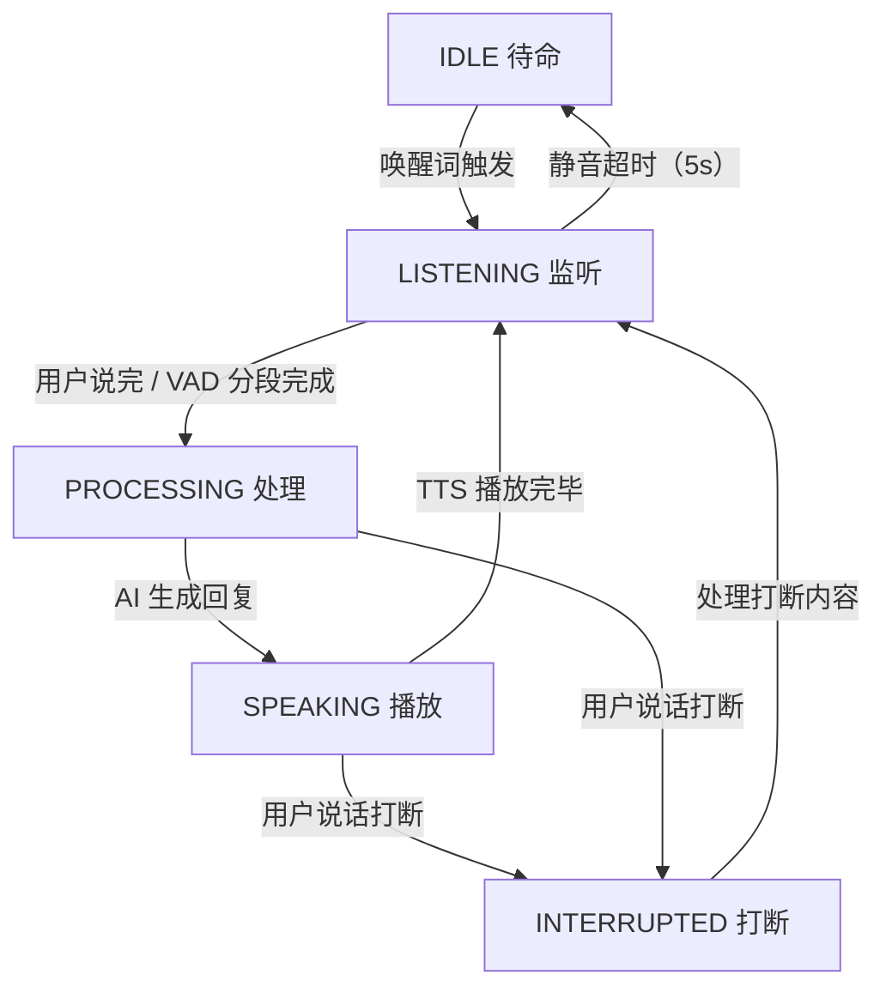

# 04 - 对话与语音系统

## 1. 对话状态机（DialogStateMachine）

对话状态机位于 `dialog/DialogStateMachine.java`，通过 Spring `@Component` 注入，以 5 个状态管理完整的对话轮次生命周期。

### 1.1 状态定义

| 状态 | 含义 |
|------|------|
| `IDLE` | 待命状态，只检测唤醒词，不响应自然语音 |
| `LISTENING` | 精确监听状态，用户正在说话，收集语音片段 |
| `PROCESSING` | AI 正在处理用户指令，生成回复 |
| `SPEAKING` | TTS 正在播放回复语音 |
| `INTERRUPTED` | 被用户打断，等待处理打断内容后进入 LISTENING |

### 1.2 状态转换图



### 1.3 关键方法

| 方法 | 说明 |
|------|------|
| `transitionTo(State)` | 同步方法，转换到新状态并记录进入时间 |
| `getState()` | 返回当前状态（volatile 保证可见性） |
| `canAcceptInput()` | LISTENING / SPEAKING / INTERRUPTED 均返回 true，允许用户随时插话 |
| `canInterrupt()` | PROCESSING 或 SPEAKING 时返回 true，表示 AI 正在输出可被打断 |
| `isSilenceTimeout()` | LISTENING 状态下超过 `silence-timeout-ms`（默认 5000ms）未检测到语音，返回 true |
| `reset()` | 强制转换回 IDLE 状态 |

---

## 2. 语音拼接器（SpeechAssembler）

语音拼接器位于 `dialog/SpeechAssembler.java`，解决 VAD 将一句话切成多段导致 AI 理解断裂的问题。

### 2.1 设计目标

VAD（语音活动检测）会根据静音间隔将语音切分成独立片段。例如用户说"打开微信给张三发消息"，如果中间有 300ms 的自然停顿，VAD 会输出两段："打开微信" 和 "给张三发消息"。直接将第一段提交给 AI 会导致指令不完整。

SpeechAssembler 通过 debounce 窗口机制，在窗口内将多段语音拼接为完整句子。

### 2.2 核心逻辑

```
用户说话: "打开微信" → "给张三发消息"
            ↓              ↓
        addSegment    addSegment    (300ms 内)
            ↓              ↓
        segments: ["打开微信", "给张三发消息"]
            ↓
    300ms 无新语音 → hasPending() 返回 true
            ↓
    getFullSentence() → "打开微信给张三发消息" → 清空 segments
```

debounce 窗口由配置 `myhelper.dialogue.debounce-window-ms` 控制，默认 **300ms**。

- `addSegment(text)` 返回 `true`：已拼接进当前句子，继续等待后续片段
- `addSegment(text)` 返回 `false`：超过窗口时间，之前的句子已完整，需要先处理
- `hasPending()` 只有在超过 debounce 窗口后才返回 true，确保提交给 AI 的是完整句子

### 2.3 关键方法

| 方法 | 说明 |
|------|------|
| `addSegment(String text)` | 添加一个 ASR 识别的语音片段，返回拼接状态 |
| `getFullSentence()` | 拼接所有待处理片段并清空，返回完整文本；无片段时返回 null |
| `hasPending()` | 是否有待处理片段且已超过 debounce 窗口 |
| `getPendingSegmentCount()` | 当前已拼接但未确认的片段数（调试用） |
| `clear()` | 清空所有片段 |

所有方法均为 `synchronized` 线程安全。

---

## 3. 声纹识别（VoiceprintService）

声纹服务位于 `service/VoiceprintService.java`，基于 Sherpa-ONNX 的 `SpeakerEmbeddingExtractor` 实现。

### 3.1 技术方案

- **模型**：`SpeakerEmbeddingExtractor`（3D-Speaker 声向量模型）
- **模型路径**：`models/speaker-embedding/model.onnx`（可通过 `sherpa.speaker.model` 配置）
- **相似度阈值**：`0.6`（可通过 `sherpa.speaker.threshold` 配置）
- **Manager**：`SpeakerEmbeddingManager` 管理已注册声纹，支持 add/remove/search/verify
- **线程数**：2 线程 CPU 推理

### 3.2 注册流程

支持两种注册方式：

**单段注册**：`registerSpeaker(name, audioSamples, sampleRate)`
- 适用于已有一段完整注册音频的场景

**多段注册**：`startEnrollment(name)` → `addEnrollmentSegment(name, segment)` × N（最多 3 段）→ `finishEnrollment(name, sampleRate)`
- 通过 `ConcurrentHashMap` 暂存多段音频，每段单独提取 embedding，通过 `manager.add(name, embeddings)` 合并为更稳定的声纹模板

### 3.3 识别流程

1. 从音频样本提取声向量：`extractEmbedding(audioSamples, sampleRate)`
   - 将音频按 3200 采样点分块送入在线流
   - 等待 `isReady` 后 `compute` 得到最终 embedding
2. 搜索匹配：`search(audioSamples, sampleRate)` → 返回最匹配的说话人名称
3. 验证指定用户：`verify(name, audioSamples, sampleRate)` → 返回是否匹配

### 3.4 非注册用户降级策略

| 场景 | 行为 |
|------|------|
| 无声纹模型（文件不存在） | `init()` 中检测并打印警告，`isAvailable()` 返回 false，任何人声音可唤醒 |
| 有模型但未注册任何用户 | 声纹比对会失败，系统可配置为提示用户"请先注册一次声纹" |
| 已注册用户 | 只响应声纹匹配通过的用户声音，拒绝他人 |

降级判定通过 `isAvailable()` 方法统一判断，上层逻辑根据返回值切换行为。

---

## 4. ASR 语音识别（LocalASR）

ASR 服务位于 `service/LocalASR.java`，采用**双模型架构**，覆盖不同精度/延迟需求。

### 4.1 在线识别（OnlineRecognizer）

- **模型类型**：Zipformer（流式 Transducer）
- **用途**：唤醒词检测 + 实时监听
- **模型文件**：`models/asr-bilingual/` 下的 encoder/decoder/joiner 三件套 + `tokens.txt`
- **解码方式**：`modified_beam_search`
- **特点**：低延迟，分块（30ms/块）送入，实时输出 partial result
- **方法**：`recognizeOnline(samples, sampleRate)`

### 4.2 离线识别（OfflineRecognizer）

- **模型类型**：Paraformer（非自回归模型）
- **用途**：对话内容高精度识别
- **模型文件**：`models/asr-offline/sherpa-onnx-paraformer-zh-small-2024-03-09/model.int8.onnx`
- **特点**：高精度，适合完整句子识别
- **方法**：`recognizeOffline(samples, sampleRate)`

### 4.3 配置参数

| 参数 | 值 |
|------|-----|
| 采样率 | 16000 Hz |
| 线程数 | 2 |
| Provider | CPU |
| 在线分块大小 | sampleRate × 30 / 1000 = 480 采样点（30ms） |

两个模型均在 `@PostConstruct` 中初始化并预热（传入 480 个空采样），首次调用时不会有冷启动延迟。

---

## 5. TTS 语音合成（TtsService）

TTS 服务位于 `service/TtsService.java`，基于 Sherpa-ONNX 的 `OfflineTts`（VITS 模型）实现。

### 5.1 模型配置

- **模型**：VITS 中文模型，路径 `models/tts-zh/`
- **首次启动**：从 classpath 解压 `model.onnx`、`tokens.txt`、`lexicon.txt` 及 `dict/` 目录（jieba 分词词典等）
- **参数**：`setMaxNumSentences(1)` 逐句生成，支持流式输出
- **预热**：初始化时生成"测试"的音频，消除首次调用 JNI 开销
- **播放采样率**：由模型输出决定，通常为 22050 Hz

### 5.2 异步播放（speakAsync）

```java
public void speakAsync(String text)
```

1. 清理文本（去除换行、截断至 500 字符）
2. 调用 `tts.generate(text)` 生成 `GeneratedAudio`
3. 将生成的音频放入 `LinkedBlockingQueue`（容量 5）
4. 后台线程 `playbackLoop` 从队列取音频并播放

### 5.3 停止/打断（stop）

```java
public void stop()
```

- 设置 `stopFlag`（AtomicBoolean）为 true
- 清空播放队列 `playQueue.clear()`
- 播放循环中检测到 `stopFlag` 后立即停止 Line 输出

### 5.4 播放状态查询（isPlaying）

```java
public boolean isPlaying()
```

返回 `playing`  volatile 标志，用于状态机中判断是否正在播放以触发打断逻辑。

### 5.5 播放线程架构

- 单独的 `tts-playback` 守护线程
- 使用 `javax.sound.sampled.SourceDataLine` 播放 PCM 数据
- 16-bit PCM 转换（float → int16，含溢出保护）
- 缓冲区大小 4096 字节，分块写入避免阻塞

---

## 6. VAD 语音活动检测（VadService）

VAD 服务位于 `service/VadService.java`，使用 **Silero VAD v4** 神经网络模型。

### 6.1 模型配置

| 参数 | 值 | 说明 |
|------|-----|------|
| `threshold` | 0.5 | 语音检测阈值（偏敏感，靠后续能量校验过滤噪音） |
| `minSilenceDuration` | 1.2s | 最短静音间隔，超过则分段 |
| `minSpeechDuration` | 0.25s | 最短语音时长，低于此值忽略 |
| `maxSpeechDuration` | 8.0s | 最长语音时长，超过强制分段 |
| `windowSize` | 512 | 滑动窗口大小 |
| `sampleRate` | 16000 Hz | 采样率 |
| 线程数 | 1 | CPU 推理 |

模型文件路径：`models/vad/silero_vad.onnx`

### 6.2 分段输出接口

| 方法 | 说明 |
|------|------|
| `acceptWaveform(samples)` | 将 PCM 音频送入 VAD |
| `hasSegment()` | 是否检测到完整语音段 |
| `nextSegment()` | 取出一个语音段（`SpeechSegment`），内部调用 `vad.front()` + `vad.pop()` |
| `isSpeech()` | 当前是否正在检测到语音 |
| `clear()` | 清空内部缓冲区 |
| `isAvailable()` | VAD 模型是否已加载 |

### 6.3 降级方案

模型文件不存在时（`isAvailable()` 返回 false），系统降级为**能量检测模式**（Energy Fallback），通过计算 PCM 振幅判断有无语音，无需神经网络模型。

---

## 7. 录音线程架构

### 7.1 单线程主循环

录音主循环以单线程运行，处理流水线为：

```
PCM 读取 → VAD 检测 → 分段输出 → SpeechAssembler 拼接 → 提交队列
```

1. **PCM 读取**：`AudioRecorder` 或 `TargetDataLine` 持续读取麦克风 PCM 数据
2. **VAD 检测**：将 PCM 送入 `VadService.acceptWaveform()`
3. **分段输出**：`VadService.hasSegment()` 轮询，有段时通过 `nextSegment()` 取出
4. **ASR 识别**：对每个语音段调用 `LocalASR.recognizeOnline()`（唤醒词阶段）或 `recognizeOffline()`（对话阶段）
5. **SpeechAssembler 拼接**：ASR 结果通过 `addSegment()` 送入拼接器
6. **提交队列**：`hasPending()` 返回 true 后通过 `getFullSentence()` 获取完整句子，提交给 AI 处理

### 7.2 TTS 播放时保持录音

TTS 播放期间录音线程**不暂停**，持续监听用户语音：
- 这是实现**自然打断**的前提
- 当 TTS 播放时检测到用户说话，状态机转换到 `INTERRUPTED`
- TTS 停止，录音线程捕获新指令

### 7.3 能量回退模式

当 VAD 模型不可用时（`isAvailable() == false`）：
- 使用 PCM 振幅的均方根（RMS）或峰值判断是否有语音
- 通过 `AudioRecorder` 记录的 `maxVal` 进行能量检测
- `LocalASR` 中也有 `maxVal < 0.001f` 的过滤逻辑，防止静音段送入 ASR

---

## 8. 自然打断机制

### 8.1 触发条件

打断需同时满足以下条件：

| 条件 | 检查方法 |
|------|----------|
| 状态为 SPEAKING 或 PROCESSING | `stateMachine.canInterrupt()` 返回 true |
| VAD 检测到语音 | `vadService.isSpeech()` 返回 true |
| 声纹匹配（可选） | `voiceprintService.search()` 匹配到已注册用户 |

### 8.2 打断流程

```
SPEAKING ──→ VAD 检测到语音 ──→ 声纹匹配 ──→ 状态机 → INTERRUPTED
                                                    │
                                                    ↓
                                            TTS.stop()
                                                    │
                                                    ↓
                                            识别打断内容
                                                    │
                                                    ↓
                                            处理为新指令 → LISTENING
```

1. **检测阶段**：录音线程在 TTS 播放时持续检测语音
2. **验证阶段**：声纹比对确认是注册用户（防误触发）
3. **状态切换**：`transitionTo(INTERRUPTED)`
4. **停止 TTS**：`ttsService.stop()` 立即停止播放，清空队列
5. **识别内容**：打断后的语音段正常走 ASR → SpeechAssembler 流程
6. **重新处理**：打断内容作为新指令提交 AI，状态机进入 LISTENING

### 8.3 打断配置

打断行为涉及的可配置参数：

| 配置项 | 默认值 | 说明 |
|--------|--------|------|
| `myhelper.voice.silence-timeout-ms` | 2000 | LISTENING 状态静音超时，超时回到 IDLE；兼容旧键 `myhelper.dialogue.silence-timeout-ms` |
| `myhelper.dialogue.debounce-window-ms` | 300 | SpeechAssembler debounce 窗口 |
| `sherpa.speaker.threshold` | 0.6 | 声纹比对相似度阈值 |
| VAD `threshold` | 0.5 | 语音检测敏感度 |
